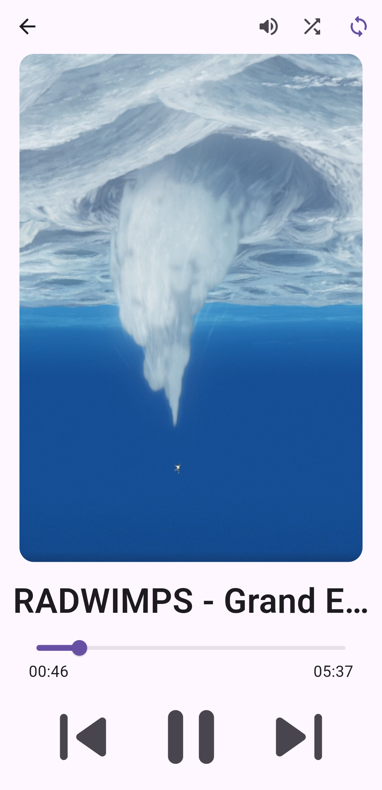

# pffs

Player for favorite songs(pffs) is a music player with a playlist system, that gives full control over playback(speed, order, clip) and sound(volume).
App is intended to run on Android, Linux and Windows and be as simple as possible.

## Screenshots

|   |  |  |
| ---------------------------------------------------- | ---------------------------------------------------- | ----------------------------------------------------------------- |


## Features

- track volume adjustment (optional: smooth switching)
- track ordering in a playlist
- track speed adjustment
- skipping parts of track

## Usage

1. Install app on your device
1. choose folder with music
1. create a playlist
1. copy folder to other device
1. go to item 1

## Tips

* To open the full screen player, click on the track name.
* To change the order of tracks in a playlist on Android, press and hold, then drag.
* To set image for a track, create file TrackName.png in the same folder.
* To set image for a playlist, create file PlaylistName.png in the same folder.

## Installation

### Windows
1. Download pffs-windows-bundle-***.zip
1. Unzip in your favorite folder
1. Run "pffs.exe"

### Linux
1. Download pffs-linux-bundle-***.tar.gz
1. Unpack to your favorite folder 
1. Install mpv
1. Run "pffs" inside this folder or add it to your PATH

### Android
1. Download pffs-***.apk
1. Install it
1. Run "pffs"

## Build

```bash
flutter build linux
```

```bash
flutter build apk
```

```bash
flutter build windows
```

